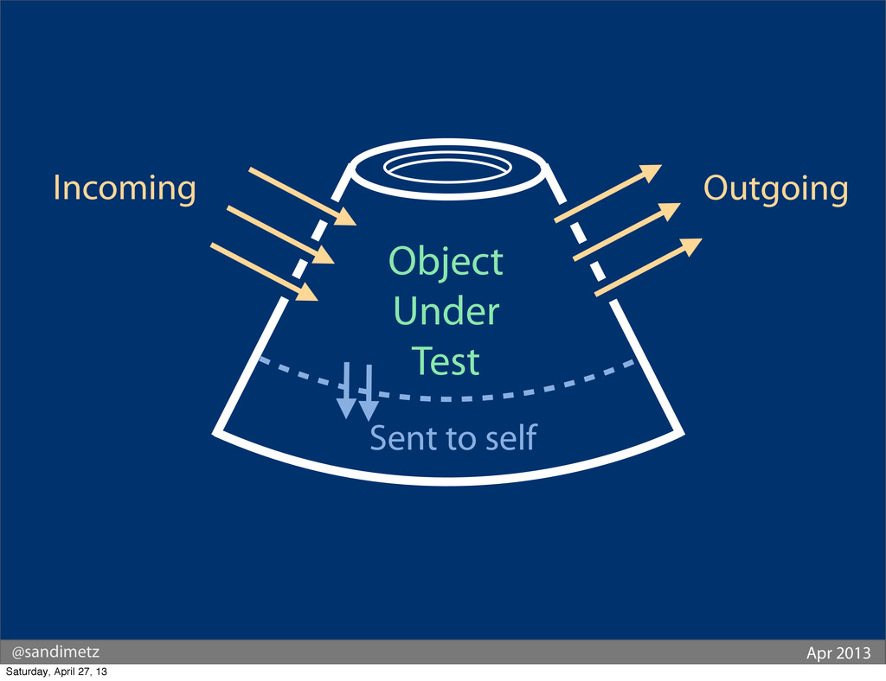

# Unit testing code style

## What to test?

A quick introduction. Consider this object under test and the various messages
it can receive or send:



In this scenario, the following table describes the only things you need to test,
and how to test them:


For more info consider watching [a keynote presented by Sandi Metz](https://www.youtube.com/watch?v=URSWYvyc42M)

But remember the key takeaway:

* The system under test is either pure, in which case you need to only make assertions
  about the returned value -- there is no need to assert that it calls its dependencies
  as long as the result is correct
* Or it’s purpose is to have side effects -- and you have to make assertions about
  messages being sent out (i.e. methods being called)

## Where do the tests live?

Test sources live in the same namespace -- test case same as SUT, test doubles same as the
interface they implement -- but are located in `tests` instead of `src`, and the autoloading
is configured only in the `autoload-dev` section. This is mostly for two reasons:

* The IDE can easily figure out where to place your auto-generated test case because
  it has its PSR roots configured, and it uses SUT’s namespace by default
* By keeping the test sources entirely separately you can easily exclude them
  from production autoloading, autowiring, set up custom deptrac rules, etc.

This should work regardless if you’re using a monorepo, or having a monolith split into
modules.

## Test doubles

Explicitly implementing test doubles instead of relying on your test framework
(i.e. `$this->createMock()`) has a number of advantages:

* You can easily create stubs with basic logic, and for example, throw
  an exception if an `InMemoryRepository::get(string $id)` does not find
  a matching record. This is much simpler than dynamically configure
  a PHPunit’s mock.
* They are first-class citizens: refactoring using either IDE or rector
  applies to them
* By naming your test doubles (fake, stub, throwing, in memory, spy, etc)
  you make the intent clear, and as such the whole test easier to read

But by all means, mock the logger if its of little importance to your scenario.

## Test scenarios

In this style, each test case has a separate Scenario File. The contents of
such scenario are as follows:

* It has a static factory method (`::of(…)`) and a fluent interface (returns self)
  so the resulting code style is nicer. YMMV.
* The constructor takes a `TestCase` -- since PHPunit tracks all executed
  assertions, we will use that test case so that the framework won’t warn
  us about a risky test.
* The constructor also initializes any default state –- dependencies,
  maybe some params the test method will be called with as input, etc.
* And then it exposes `given` methods to modify that state: for example
  by replacing the `InMemoryRepository::empty()` by `ThrowingRepository`
* Usually a single `when` responsible for stitching the SUT together,
  sending a message (executing a method) and gathering the results,
  including any thrown exceptions, for later inspection.
* And finally, a set of `then` methods to make assertions about the result,
  thrown exceptions, and any side effects recorded by our spies.

These methods may of course take any number of parameters so that the test
is more readable. Don’t be afraid to add helper methods, for example so that
each `given` may be called as an `and…()`.

## Assertions

The framework teaches you all about these different kinds of assertions
and expectations. Here, there is only one syntax: `$this->testCase::asert()`:

* Assertions about `$this->actual` (initialized in a `when` method) to
  test the result values
* Similar assertions about `$this->actual` when expecting an exception.
  Just catch anything thrown from SUT and assign it to this field, and
  in a `then` method you can test if has the correct type or properties
* Finally, if you need to make sure a message was sent out, make a Spy
  test double that just exposes all the calls it receives in a public
  field, and make assertions about that field’s contents

## Final effects

Each of your test cases is simple and concise:

* test inputs are extracted to a separate data provider
* scenario implementation is in a separate file
* and that itself is further split into test doubles, mothers, et al.
* whatever is left is a simple, gherkin-style scenario outline

```php
#[DataProviderExternal(External::class, 'data')]
function test_whatever(string $input, string $expected): void {
  TestScenario::of($this)
    ->givenSomeInput($input)
    ->whenExecuted()
    ->thenOutputIsExpected($expected);
}
```
